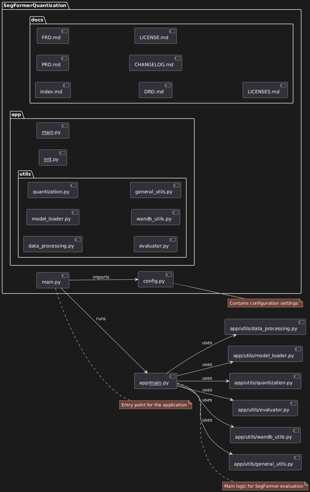
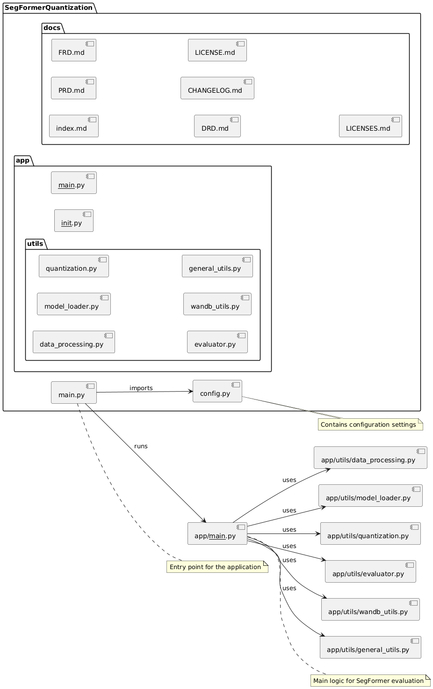

# SegFormer Quantization Pipeline

An end-to-end evaluation pipeline for SegFormer models on semantic segmentation tasks, with support for various quantization methods.

[](https://www.codefactor.io/repository/github/qte77/SegFormerQuantization)
[](https://github.com/qte77/SegFormerQuantization/actions/workflows/ruff.yml)
[](https://github.com/qte77/SegFormerQuantization/actions/workflows/links-fail-fast.yml)
[](https://vscode.dev/github/qte77/SegFormerQuantization)

## Status

[DRAFT] [WIP] ----> Not fully implemented yet

The current version is <0.2.1>. For version history have a look at the [CHANGELOG](CHANGELOG.md).

## TOC

* [Features](#features-)
* [Setup](#setup-)
* [Usage](#usage-)
* [Configuration](#configuration-)
* [Project Structure](#project-structure-)
* [Documentation](#documentation-)
* [UML](#uml-)
* [TODO](#todo-)
* [License](#license-)

## Features [↑](#toc)

- Model loading and quantization (float8, int8, int4, int2)
- Dataset processing and sharding
- Evaluation metrics computation (mean IoU, mean accuracy, overall accuracy)
- Integration with Weights & Biases for experiment tracking
	
## Setup [↑](#toc)

1. Install dependencies: `poetry install` or `pip install -r requirements.txt`
2. Set up Weights & Biases API key in environment variables

## Usage [↑](#toc)

```python
python -m app/app.py
```

or

```bash
docker build -t segformer-quant-eval .
docker run segformer-quant-eval
```

## Configuration [↑](#toc)

Adjust settings in `app/config.py` for model, dataset, and evaluation parameters.

## Documentation [↑](#toc)

[Documentation SegFormer Quantization Pipeline](https://qte77.github.io/SegFormerQuantization/

## Project Structure [↑](#toc)

```
/
├── app/
│ ├── app.py
│ ├── config.py
│ └── utils/
│   ├── data_processing.py
│   ├── evaluator.py
│   ├── general_utils.py
│   ├── model_loader.py
│   ├── quantization.py
│   └── wandb_utils.py
└── pyproject.toml
```

## UML [↑](#toc)

[](./#gh-dark-mode-only)
[](./#gh-light-mode-only)

## TODO [↑](#toc)

- [ ] Implement tests before concrete function (TDD)
- [ ] Use pydantic or similar
- [ ] Add .txt ot LICENSE/LICENSES to avoid download instead of open
- README.md
	- [ ] Insert link to and report of WandB project
	- [ ] Remove/Change #href ↑(#toc) to avoid conflict with gh-pages
	- [ ] Remove/Change #href for light/dark png to avoid conflict with gh-pages

## License [↑](#toc)

This project is licensed under the BSD 3-Clause License. See the [LICENSE](LICENSE) file for details.
For third-party licenses, see the [LICENSES](LICENSES) file.

